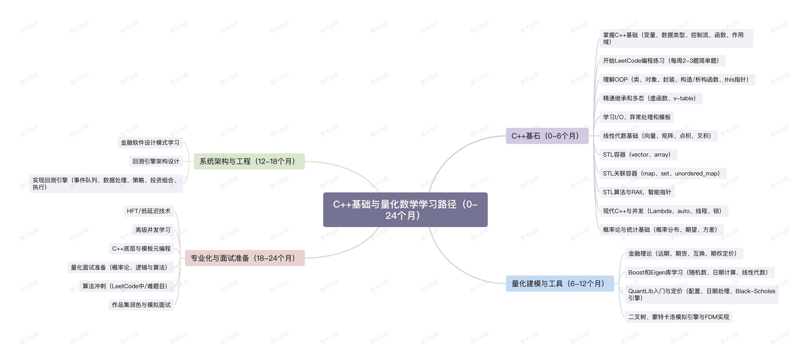

# 104周量化开发者学习计划

> ⚠️ **项目暂停通知**
>
> 非常抱歉，由于近期工作繁忙，个人精力实在无法兼顾，本项目即日起**无限期停更**。
>
> 量化一直是我的热爱，这份学习计划也是我认真梳理的产物。未来如果有缘，生活节奏稳定下来后，我一定会想办法继续更新下去。
>
> 感谢每一位 star、fork 和关注这个项目的朋友。你们的关注是我当初动笔的动力，没能坚持下去，深感抱歉 🙏
>
> — Shuheng Mo

> 一个普通人从零开始，104周成为合格的量化开发工程师(QD)🚀

## 📚 项目概述
>
> 学习计划参考文件`qd_study_plan_104wk.csv`

这是一份详细的学习路线图，旨在帮助项目作者本人 **104 周（2年）** 内系统性地掌握成为量化开发工程师所需的所有技能。从 C++ 基础到金融衍生品定价，再到高频交易系统架构，每个阶段都有明确的学习目标和实战项目。

整个学习计划执行过程中的心得和经验将会记录在[每周学习报告](./weekly_reports/)中并同步发布到小红书、知乎和X，欢迎大家关注和交流👏！

📱相关社媒链接:

- 🔗[Rednote](https://www.xiaohongshu.com/discovery/item/690dcc4b0000000007008eec?source=webshare&xhsshare=pc_web&xsec_token=AB7q0TRY1GovTesRR9HbrasJ7DiP8yZSSTHMGiVQPtRoA=&xsec_source=pc_share)

- 🔗[Zhihu](https://zhuanlan.zhihu.com/p/1974179072931304335)

- 🔗[X](https://x.com/ShuhengM47914/status/1990726716109603012?s=20)

🚨**特别说明**：
本项目是本人学习的输出和感想，主要作用是提供一种视角和框架，**并非**专业的技术教程、投资建议或者职业规划建议，希望大家理性参考并结合自己自身的实际情况进行拓展和发散，不要照搬本项目中的内容。如有任何建议和意见，都可以通过社媒平台与我交流，谢谢🙏！

---

## 学习阶段划分

### 第一阶段：C++ 基石与量化数学（0-6 个月 | 第 1-26 周）

**核心目标**：掌握 C++ 编程基础和量化金融的数学基础

#### 1. C++ 基础模块（第 1-10 周）

- **第 1-2 周**：C++ 基础
- **第 3-4 周**：面向对象编程（OOP）核心
- **第 5-6 周**：OOP 高级特性
- **第 7-8 周**：I/O 与异常处理
- **第 9-10 周**：模板编程

#### 2. 数学基础模块（第 11-14 周）

- **第 11-12 周**：线性代数 I
- **第 13-14 周**：线性代数 II

#### 3. STL 与现代 C++ 模块（第 15-24 周）

- **第 15-16 周**：STL 容器
- **第 17-18 周**：STL 关联容器
- **第 19-20 周**：STL 算法与 RAII
- **第 21-22 周**：智能指针
- **第 23-24 周**：现代 C++ 与并发

#### 4. 概率论基础（第 25-26 周）

- **第 25-26 周**：概率论与统计基础

---

### 第二阶段：量化建模与工具（6-12 个月 | 第 27-52 周）

**核心目标**：学习金融理论和常用的量化库，实现基础定价模型

#### 1. 金融理论模块（第 27-34 周）

- **第 27-30 周**：金融理论 I
- **第 31-34 周**：金融理论 II

#### 2. C++ 库应用模块（第 35-42 周）

- **第 35-36 周**：Boost C++ 库 - Random
- **第 37-38 周**：Boost C++ 库 - 高级工具
- **第 39-40 周**：Eigen 库 I
- **第 41-42 周**：Eigen 库 II

#### 3. QuantLib 与定价引擎模块（第 43-52 周）

- **第 43-44 周**：QuantLib 入门
- **第 45-46 周**：QuantLib 定价
- **第 47-48 周**：**P2 核心项目 - 二叉树定价器**
- **第 49-50 周**：**P2 核心项目 - 蒙特卡洛模拟**
- **第 51-52 周**：**P2 核心项目 - 有限差分法（FDM）**

---

### 第三阶段：系统架构与工程（12-18 个月 | 第 53-78 周）

**核心目标**：深入学习设计模式，实现完整的回测引擎系统

#### 1. 设计模式模块（第 53-56 周）

- **第 53-54 周**：设计模式 I
- **第 55-56 周**：设计模式 II

#### 2. **P3 核心项目 - 完整的回测引擎**（第 57-78 周）

- **第 57-60 周**：回测引擎 - 架构设计
- **第 61-64 周**：回测引擎 - 数据模块
- **第 65-68 周**：回测引擎 - 策略模块
- **第 69-72 周**：回测引擎 - 投资组合模块
- **第 73-76 周**：回测引擎 - 执行模块
- **第 77-78 周**：回测引擎 - 集成与报告

---

### 第四阶段：专业化与面试准备（18-24 个月 | 第 79-104 周）

**核心目标**：专业方向深化学习，准备顶级公司面试

#### 1. 专业方向模块

- **第 79-82 周**：专业化方向 - HFT/低延迟
- **第 83-86 周**：专业化方向 - 高级并发
- **第 87-90 周**：C++ 底层与模板元编程（TMP）

#### 2. 量化面试准备模块（第 91-98 周）

- **第 91-94 周**：量化面试 - 概率论
- **第 95-98 周**：量化面试 - 逻辑与算法

#### 3. 最终冲刺模块（第 99-104 周）

- **第 99-101 周**：算法冲刺
- **第 102-104 周**：作品集润色与模拟面试

---

## 📊 学习进度跟踪

| 阶段 | 时长 | 周数 | 核心成果 |
|------|------|------|--------|
| **第一阶段** | 0-6 个月 | 1-26 | P1：限价订单簿（LOB）系统 |
| **第二阶段** | 6-12 个月 | 27-52 | P2：三种期权定价模型 |
| **第三阶段** | 12-18 个月 | 53-78 | P3：完整回测引擎 |
| **第四阶段** | 18-24 个月 | 79-104 | 高质量代码作品集 + 面试准备 |

---

## 🎓 关键学习资源

- **C++ 编程**：《C++ Primer》《Effective C++》《Modern C++》
- **金融理论**：《期权、期货及其他衍生品》（John Hull）
- **量化面试**：《A Practical Guide to Quantitative Finance Interviews》（绿皮书）
- **开源库**：Boost、Eigen、QuantLib
- **实战练习**：LeetCode、QuantNet
- **项目管理**：Git、CMake
- **其他资源**: ...

---

## 💡 核心项目

### 项目 1（P1）：限价订单簿（LOB）

- 完整的订单管理系统
- 多线程并发安全
- 第 19-22 周核心实现

### 项目 2（P2）：期权定价引擎

- 二叉树模型
- 蒙特卡洛模拟
- 有限差分法（FDM）
- 第 47-52 周核心实现

### 项目 3（P3）：完整回测系统

- 事件驱动架构
- 策略框架
- 投资组合管理
- 性能报告生成
- 第 57-78 周核心实现

---
...
